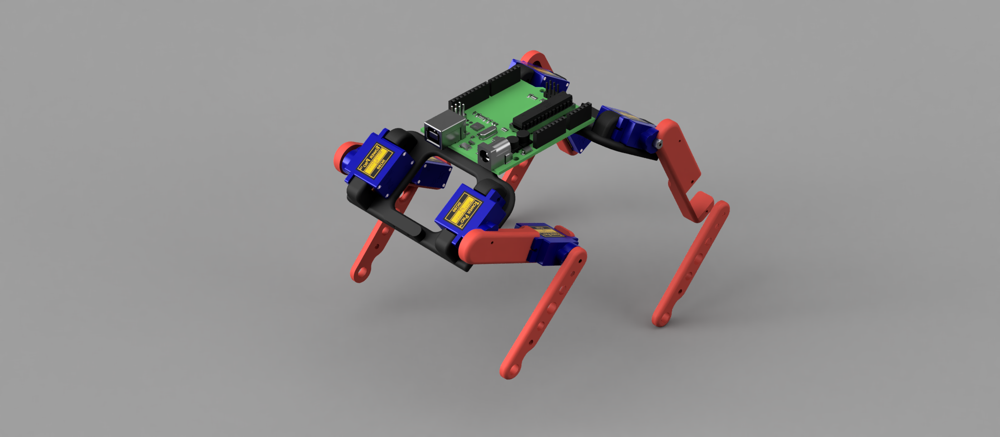
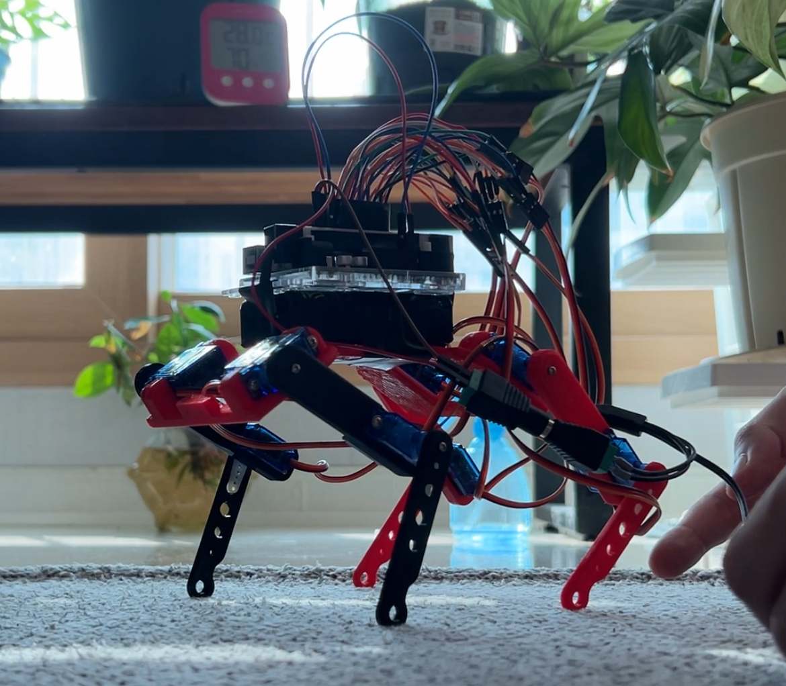

# Cheap and Opensource Robot Dog (CORD)
CORD is an open-source project that offers a starting point for those new to legged robotics or anyone seeking to build a dog robot, develop gait algorithms or contribute to a quadruped robot project. The robot's design and structure prioritize simplicity and cost-efficiency.

### CORD v1.0 :
#### 1. Goal
Build a robot dog using only sg90 servos and an Arduino.

#### 2. Recipe
1. 8x [SG90 servos](https://www.amazon.com/Smraza-Helicopter-Airplane-Control-Arduino/dp/B07L2SF3R4/ref=sr_1_1_sspa?crid=1PE3XILS3M9B&dib=eyJ2IjoiMSJ9.POZxW8ictf28-1c0EFTfUtpz8IcpNw1Sy3NcRG-ruBAZ9OKsCimJ7i5o4Q5w--1pvbv73DKO57bRwRfqzpCIDTiJbP0ivyg7DkDdjCtxIBtcm2MTgNSnNiNYF8C1nWYxx12TwiHEoHYc4JUzbP4gvZhIwxNJiRBoq2MjNZcguNFbrQsSIPGFBAIMGlwLmJRW4Be7_jBfOvlLpm7oEbcjD2Rx-DjYIOznwFK3HIahF4ispuOLVAOnIOw2tLeG9fbk-hSOWRRRzl8IgCKdrA48eMhoXgH7KPsex3aG6aAifqY.bLNI5LhYje-RU6tJEZvuxHtTCTlQCtV0XCbq0BsOuBg&dib_tag=se&keywords=sg90&qid=1723649254&sprefix=sg%2Caps%2C275&sr=8-1-spons&sp_csd=d2lkZ2V0TmFtZT1zcF9hdGY&psc=1) (18.99\$)
2. [Arduino (Uno or Nano)](https://www.amazon.com/Arduino-A000066-ARDUINO-UNO-R3/dp/B008GRTSV6/ref=sr_1_1?crid=3PGEJG7FN2A6Z&dib=eyJ2IjoiMSJ9.MazmhFfn-DF8W5oyX_S-tH7qkt_WuogERq_8M3-FTf7RaTJjfJhh9u9oYVUHTxDJyyZbgTGmcQkdD3h3ZpwrtwF9uyXZqSuCW8xBV72lPmcGZQkJIiuOVFT4vDbqNrA-5MOeoZsrmDq0B9xtuvYWAYiFEojMZHmpjIJDrmbjINW3qmSDGv023gOVYyJ6AxGBnVSLlqdyYvt6LauxN_SUZPn6Jvv0b2WFyRpugylfe3I.Z3fFH2tAkQ-9yHqP-wAzc2tg5cZaj5NSC36MGKt2DpY&dib_tag=se&keywords=arduino+uno&qid=1723649430&sprefix=arduino+u%2Caps%2C250&sr=8-1) (27.60\$)
3. 3D printed parts (150 x 150 x 150 printer printable)
4. 2x 18650 Lipo (3.7V, 3500mAh)
   1. [Power souce to connect to V_in and Gnd of Arduino](https://www.amazon.com/inShareplus-Mounted-Switching-Connector-Adapter/dp/B01GD4ZQRS/ref=sr_1_7_sspa?crid=3BGOGBHQVRDJV&dib=eyJ2IjoiMSJ9.AIBT0pk4R1eZvXjoD2HvpiLNlcnMKRU9YcNGEsQmq2fcyBYUVjJ_Z1gAN9UkauVIVtdVE4n7D3-FRjKuLPUbRMlPhDBmFapRl8UaMe66RLUNNJ9QR4Mwnj1GIm86MoWGkM7r57tCw3A7Ov0P6j3NIfOnSNW-zkEtC7gJlTni0Vdp4vbw_6F_uViqUNOwm2JXWJCVnrTOWlDqIOQ4Ojcrf-voun1hHuARIVO01V28xoE.sy1hTE_1Na3GWeG_GirDURffGfb6iSWVthNkajmgwzs&dib_tag=se&keywords=dc+power+supply&qid=1723649680&sprefix=dc+power+supp%2Caps%2C246&sr=8-7-spons&sp_csd=d2lkZ2V0TmFtZT1zcF9tdGY&psc=1) (7.89\$)
5. Breadboard power rail (2.99\$)
6. [Jumper Wires](https://www.amazon.com/Elegoo-EL-CP-004-Multicolored-Breadboard-arduino/dp/B01EV70C78/ref=sr_1_3?crid=1NLDEEH223U9P&dib=eyJ2IjoiMSJ9.3RCqBV5uANqz97h11oobg3tY4BPPlWKXqjmdxW0aLzd--QTMRK1h-k_SsePr6iXGqGMxWNQtgLShE82wiG7qbFkTYLHSbFlUf0J8w7j4PyEJKfKHZiSxrvOx0sDJCBcy5bC0PVvRYSZ7sJm_vGpH3pS-9qQGJ67i3lPWU1tjzVur6RL_VUzRHkkIUgtfXMlEFgf0gEgzEp5cgsHGE_AXHy3tikhRv3i53BYMbl4OnRA.IzroPB2JqLl3angYSkSRwMQLu7A6ztbHaNJph4F7pTE&dib_tag=se&keywords=arduino%2Bwires&qid=1723649511&sprefix=arduino%2Bwi%2Caps%2C248&sr=8-3&th=1) (6.98\$)

Total of 64.45\$ (if all components need to be purchased).

#### 3. Render
Designed with Fusion 360

<!--  -->


#### 4. Structure

```cpp
leg 5         leg 6
|                |
|                |
|-| leg 1      |-| leg 2
  |            |
  |____________|
  |            |
  |    BODY    |
  |____________|
  | leg 3      | leg 4
  |            |
|-|            |-| 
|                |
|                |
leg 7      leg 8
```

#### 5. Instructions
1. Acquire required components
2. Print, put together 3D print parts
3. Calibrate legs
   1. Configure resting servo angles
   2. Cord_initialize.ino
   3. Cord_stand.ino
   4. Cord_crawlGait.ino
4. Develop new gait algorithms & functions!

#### 6. CORD v1.0


#### 7. Moving Forward:
Possible Additions:
1. MG90s: Higher torque servos (13.6g;2.2kg/cm;10/27.59\$)
   1. SG90 (9g;1.6kg/cm;10/18.99\$)
2. PCA9685: Servo Driver (scalable and organized servo control)
3. LM2596: Step Down Converter 
   1. Limitation: Output current limited to 2000mAh
4. Arduino Nano: Reduce size 
5. Arduino Ultrasonic Sensor: Obstacle avoidance
6. Trot gait, creep gait