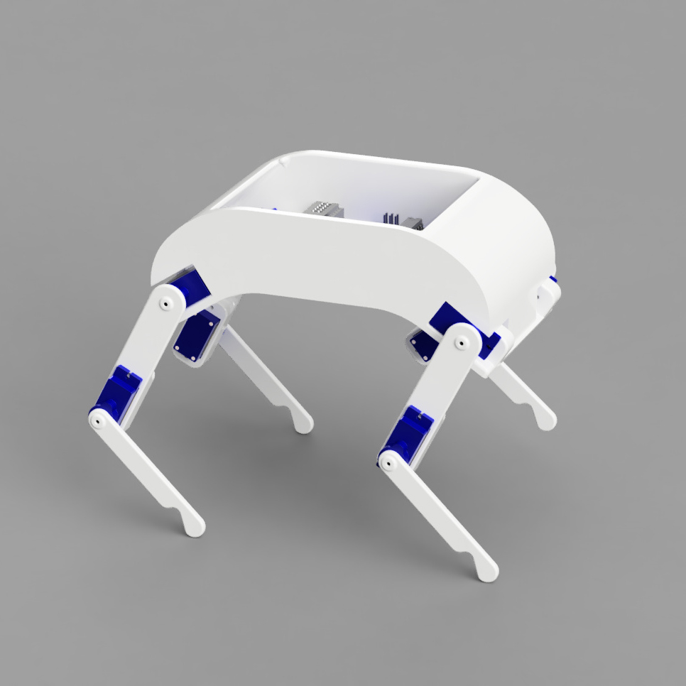

# CORD
Project to enable starter roboticists to build a cheap, easy quadruped robot.

### Current plan:

Recipe:
1. 8x SG90 servos
2. Arduino (Uno or Nano)
3. 3D printed parts (150 x 150 x 150 printer printable)
4. 2x 18650 Lipo (3.7V, 3500mAh)
5. Breadboard power rail
6. lots and lots of wires

Render:
